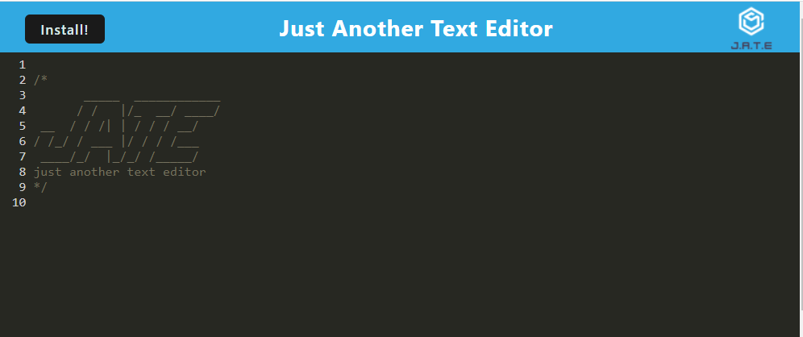
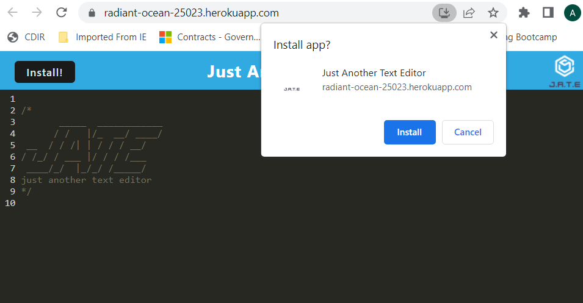
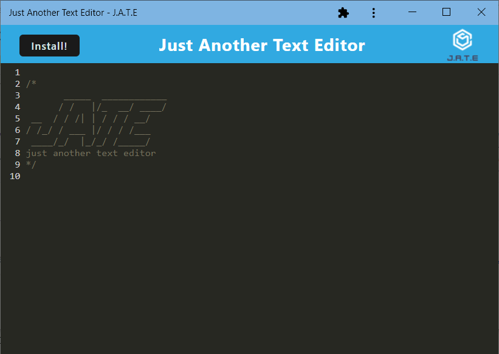

# text-editor-pwa
A single-page text editor PWA that works offline and uses IndexedDB to get and store data.

## User Story
AS A developer  
I WANT to create notes or code snippets with or without an internet connection  
SO THAT I can reliably retrieve them for later use

## Link to Deployed App
[Text Editor PWA](https://radiant-ocean-25023.herokuapp.com/)

## Functionality
Code:  
* Client and server code are separated into distinct folders
* Start-up scripts can run builds and installs, start the client and server individually, or start them concurrently
* When the build script is run, webpack bundles JS files and generates an HTML file, service worker, manifest file, and icons of various sizes  
Site:
* IndexedDB and local storage save user-entered data after clicking off the DOM window, which persists after browser is closed and reopened
* Service worker and manifest are available and active
* Static assets are pre-cached upon loading
* Install button downloads the web app onto the desktop

## Screenshots

## License
This project is licensed under the MIT License - see the LICENSE.md file for details.

# NPM Package Dependencies
- [Express](https://www.npmjs.com/package/express)  
- [CodeMirror Themes](https://www.npmjs.com/package/code-mirror-themes)
- [IndexedDB](https://www.npmjs.com/package/idb)
